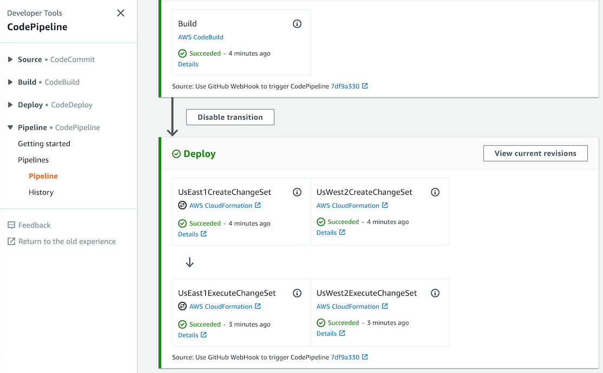
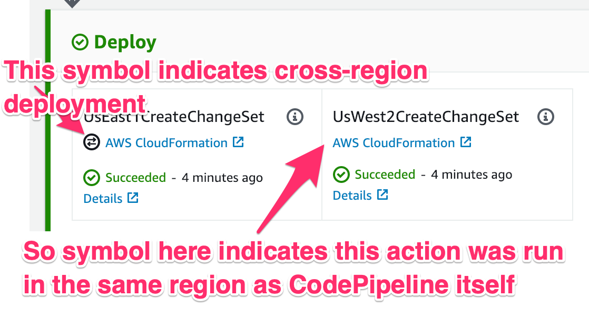

# Multi Region CodePipeline example

This is a "walking skeleton" application that you can modify to create a continuously deployed AWS application
using AWS CodePipeline, to multiple AWS regions. If you don't know what "AWS Regions" or CodePipeline are, or why you might want them, then you might want to do some Googling before using this example.

The following core AWS services are used in example.

* The application is a simple [AWS Lambda](https://aws.amazon.com/lambda/) function (defined in `template.yaml`), that is deployed using [SAM](https://docs.aws.amazon.com/serverless-application-model/latest/developerguide/what-is-sam.html) / [CloudFormation](https://aws.amazon.com/cloudformation/). This is purely an example - the same technique can be used for significantly more complicated applications.
* The deployment pipeline is implemented using [AWS CodePipeline](https://aws.amazon.com/codepipeline/) (defined in `deployment-pipeline/pipeline.yaml`)
* The deployment pipeline makes use of [AWS CodeBuild](https://aws.amazon.com/codebuild/), defined within the pipeline template, plus also `deployment-pipeline/buildpec.yaml`, using the build script `multiregion-build.sh`

In summary, by using this example you will have a continuously deployed application, targeting multiple AWS regions, using only AWS services, a single CodePipeline instance, and zero custom tasks or custom resources.

The documentation with this example assumes you have a working knowledge of using the AWS CLI from a terminal, CloudFormation, and some modicum of familiarity of CodePipeline and CodeBuild.



## How to create the pipeline

1. Fork this repository to your own GitHub repository (or elsewhere.)

1. By default the application will use the Github repository `symphoniacloud/multi-region-codepipeline` as its source repository. Update the `GitHubOwner` and `GitHubRepo` default parameter values in `deployment-pipeline/pipeline.yaml` for your values. Alternatively if you're not using Github then change the Pipeline `Source` stage (but that's out of scope for this readme.)

1. Assuming you are using GitHub then create a new GitHub personal access token for this application. See [here](https://help.github.com/articles/creating-a-personal-access-token-for-the-command-line/) for how to do this - CodePipeline needs just the `repo` scope permissions. I recommend you name the token for this particular pipeline, at least to get started, and that you store the token somewhere safe, like a password manager.

1. By default the application CloudFormation stack will be named `multi-region-codepipeline-app`, and the CodePipeline stack will be named `multi-region-codepipeline`. If / when you want to change these then update the following files, looking for references to `multi-region-codepipeline` :
    * `deployment-pipeline/create-artifact-buckets.sh`
    * `deployment-pipeline/create-pipeline.sh`
    * `deployment-pipeline/update-pipeline.sh`
    * `deployment-pipeline/artifact-buckets.yaml`
    * `deployment-pipeline/pipeline.yaml`
    * `package.json`
    * `template.yaml`

1. By default the application will be deployed to us-east-1 (N Virginia) and us-west-2 (Oregon). If / when you want to change this list then update the following files, looking for references to these regions:
    * `deployment-pipeline/create-artifact-buckets.sh`
    * `deployment-pipeline/pipeline.yaml`
    * `deployment-pipeline/buildspec.yaml`
    * `multiregion-build.sh`

1. Commit all your changes to source control

1. Now from a terminal run the following (this assumes the AWS CLI is installed and configured). Make sure the terminal is configured to use the AWS region where you want the pipeline itself to run (or override using the `--region` flag), and that it is configured to use the account where the pipeline and application will run:

``` bash
$ cd deployment-pipeline
$ ./create-artifact-buckets.sh

# Check new buckets have been created in correct regions in S3 console. Take the prefix,
# everything up to `-region-name`, and use that as the second argument below

$ ./create-pipeline.sh YOUR-GITHUB-TOKEN ARTIFACT-BUCKET-NAME-PREFIX
```

Once you've run this last command then watch both the CloudFormation and then CodePipeline consoles to evaluate whether the process has been successful.

To test everything, after the pipeline has successfully completed it's first run, check that you have new lambda functions named `MyLambdaFunction-GENERATEDSTACKNAME` in each of your target regions. You can execute these Lambdas from the Web Console using any test event as input.

## How to update the pipeline

When you need to update the application code or structure (as defined in `template.yaml`), or when you need to change how the application is built (either in the `multiregion-build.sh` or `deployment-pipeline/buildspec.yaml` files), then simply pushing your changes to source control will be sufficient - CodePipeline references these files from source on every pipeline run.

If you need to change the structure of the CodePipeline itself then run `deployment-pipeline/update-pipeline.sh` with the same arguments that you ran `create-pipeline.sh`.

If you need to add or change regions, then do the following:

1. Update the 4 files listed above in step 5 under creating the pipeline, changing the regions where referenced
2. If you are **adding** regions, then change `create-artifact-buckets.sh` to **just** specify the regions that you are adding
3. Re-run `create-artifact-buckets.sh`, and then update the pipeline as described above.

## How this works

Back in the dim an distant past of 8 weeks ago (before November 12 2018), it was not possible to use CodePipeline for cross-region actions, and so if you wanted to do multi-region CD you either needed to create a CodePipeline for each region (bleurgh), create custom workflow (sigh), or not use CodePipeline (whaaah!)

But as of November 2018 CodePipeline supports "[Cross-Region Actions](https://docs.aws.amazon.com/codepipeline/latest/userguide/actions-create-cross-region.html)", meaning none of the above work-arounds are necessary. Huzzah! If you look in `deployment-pipeline/pipeline.yaml` you'll see the new `Region:` property being used on the "Deploy" actions. We duplicate the deploy actions for each region, parallelizing them to speed up the total deployment process.



So Multi-region CD is now easy on AWS, right? Well, no, not quite, there are still some friction points.

The main concern is that if you're deploying using CloudFormation / SAM, then you are still hamstrung by CloudFormation's limitation that the template and resources used during a CloudFormation deployment must be in a bucket in the same region that the CloudFormation stack is deployed to. In other words if you're deploying to `us-west-2` then the CloudFormation template, and artifacts it references, must also be in a bucket in `us-west-2`, and by extension you need a separate artifact bucket per region you're deploying to.

The new cross-region CodePipeline support helps somewhat with this in that you can now provide a set of `ArtifactStores`, with one `ArtifactStore` per region. CodePipeline will automatically sync up the `ArtifactStores` during the course of the pipeline run. If you look in `deployment-pipeline/pipeline.yaml` you'll see the new `ArtifactStores:` property being used on the CodePipeline resource. 

However, we're still left with two problems:

* How do we create the artifact store buckets in the first place?
* How do we create packaged applications for each region?

The first of these is a problem because you can't create S3 buckets in a CloudFormation template outside of the current region. For a single-region pipeline you can create an S3 bucket inline in the same template that the CodePipeline resources are defined in; with multi-region you can't. That means we need to create the buckets *before* creating the pipeline.

For this reason this example app includes the `artifact-buckets.yaml` template, and the `create-artifact-buckets.sh` script, which needs to be run before creating the pipeline.

It's possible that this might be fixable with a CloudFormation custom resource, but I haven't investigated that.

The last problem is that we need separately packaged applications per region. I'm using SAM here, and specifically the `aws cloudformation package` command during the CodeBuild stage. We *could* run CodeBuild once per region, just like we're running CloudFormation once per region during the deployment stage, but that's a little wasteful for CodeBuild, especially for when our build times get longer.

So instead, *during the build stage*, we run `aws cloudformation package` **once per region** , using the `--region` flag (see `multiregion-build.sh`, which is itself is referenced by the CodeBuild build spec `deployment-pipeline/buildspec.yaml`). This creates all of our artifacts, and now our application can happily be deployed.

So, in summary, here's how this works:

- Create pipeline S3 artifact buckets as prerequisites
- Within the pipeline run CodeBuild in the primary region (the same region as CodePipeline itself), but produce artifacts during the Build stage for all regions, using the `--region` flag at `cloudformation package` time
- Use the CodePipeline `ArtifactStores` construct, along with multiple parallel deployment actions each using the `Region:` property.

## Teardown

:warning: Run these steps **in order**, otherwise you may end up with stranded resources:

1. Delete the application stacks **from all regions**
1. Delete all artifact buckets
1. Delete the pipeline stack

## Questions, Comments, Additions, Suggestions

If you have any questions, comments, additions or suggestions please feel free to comment through GitHub, on twitter at [@mikebroberts](https://twitter.com/mikebroberts), or via email at mike@symphonia.io.

If your company is looking for help using CodePipeline, CloudFormation, or architecture using AWS then please contact us at [Symphonia](https://www.symphonia.io/).

## TODO

* Sort out IAM permissions in pipeline.yaml
* Consider using CDK version (better for repetition of resources)
* Consider custom resources, or something else, to allow cross-region buckets to be managed in `pipeline.yaml` file
